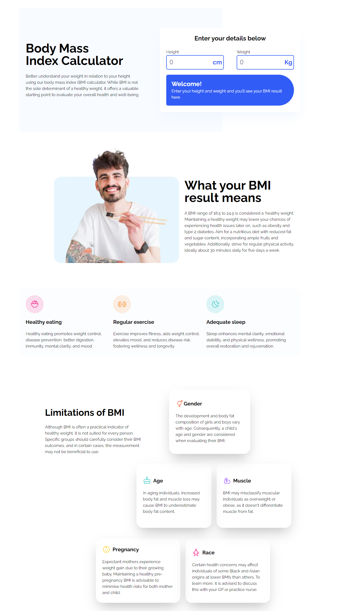

# BMI calculator - Jobayer Rahman Ohee

## [Live link](https://bmi-calculator-jobayer.netlify.app/)

```This is a frontend-based web application. The sole purpose of this application is to help individuals to calculate their Body Mass Index. along with that, it will educate them about its importance and limitations. ```

## Technology used:

1. React
2. Tailwind

<hr/>

# F.A.Q

### How to use?
If you want to use it I have already added the live link here. simply you just have to lick on it and use is according to your needs.

### What about any dependency?
This is a frontend application without any backend integration so you don't need to worry about any additional dependency. Simply clone it and install the necessary libraries with the `npm I` or `npm install` command.


